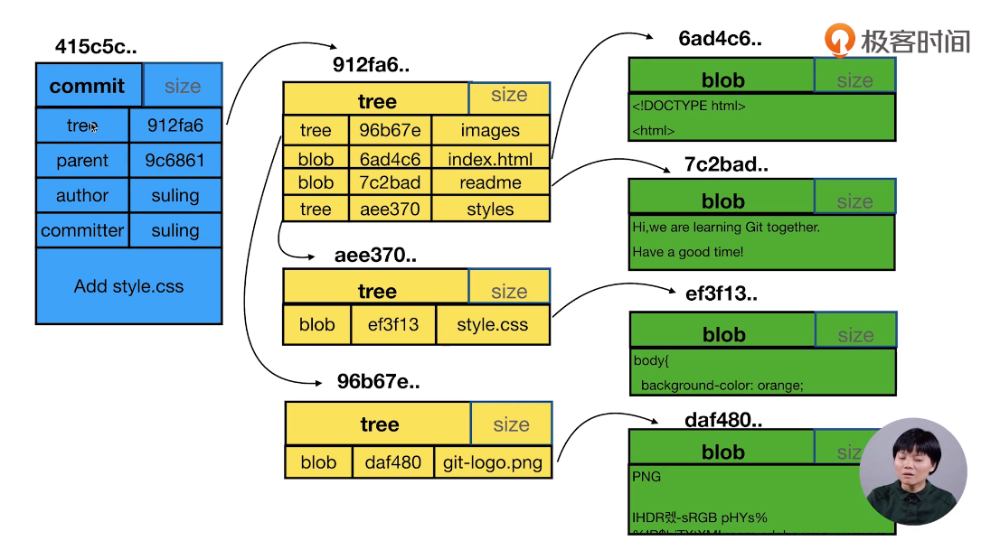

## 第一章 Git 基础

#### 1.1. 配置 user 信息

```shell
$ git config --global user.name 'strongnine'
$ git config --global user.email 'strongnine@163.com'
```

#### 1.2. config 的三个作用域

```shell
$ git config --global
$ git config --local
# 显示 config 设置
$ git config --list --local
$ git config --list --global
```

**创建仓库**

```shell
$ git init
$ git init ./'git_learning'
# 添加文件
$ git add ./README.md
$ git status
$ git commit -m'Add README.md'
$ git log
```

**往仓库里面添加文件**：参考项目 https://github.com/TTN-js/unforGITtable

```shell
# status 会提示目前的状态，Untracked 代表文件从来没有被管理过
$ git status
# add 可以添加多个文件，例如：
$ git add index.hrml images
# 把变更变成一次正式的提交
$ git commit -m'Add index + logo'
$ git log

# 新用法：把工作区上所有已经被 git 管理的文件一起放到暂存区
# 将文件的修改、文件的删除，添加到暂存区
$ git add -u
```

网友「易风」的补充：

>git add -u：将文件的修改、文件的删除，添加到暂存区。
>
>git add .：将文件的修改，文件的新建，添加到暂存区。
>
>git add -A：将文件的修改，文件的删除，文件的新建，添加到暂存区。
>
>git add -A 相对于 git add -u 命令的优点 ： 可以提交所有被删除、被替换、被修改和新增的文件到数据暂存区，而 git add -u 只能操作跟踪过的文件。git add -A 等同于 git add -all。

**重命名的文件**：`git mv oldname newname`

```shell
# 想要重命名一个文件，当你修改了之后用 status 会发现
# 提示你有一个文件被删除，有另一个文件是新的 Untracked files
$ git add
$ git rm

# 可以使用 reset 来对暂存区的文件进行重置
# 注意这是一条相对危险的命令
$ git reset --hard

# 重命名操作可以有直接的方式
$ git mv readme readme.md
```

#### **查看版本演变历史**：`git log`

```shell
# git log 不带参数的时候是整个完整的日记
# 如果加上 --oneline，就只显示每次提交的备注
$ git log --oneline

# 还可以指定最近的几个 commit，以 4 为例：
$ git log -n4 --oneline

# 查看本地有多少分支和创建分支
$ git branch -v
$ git checkout -b temp 415c5c...

# git log 只显示当前分支的日志，--all 查看全部分支
$ git log --all
# 还可以图形化显示
$ git log --all --graph
```

网友「夕夕熊」补充：

> 加上 --decorate 参数，部分同学才可以显示（master）（temp）等分支信息。

#### **通过图形界面查看版本历史**：

```shell
# 命令行输入 gitk 会弹出图形界面
$ gitk
```

#### .git 目录的内容

cat 命令主要用来查看文件内容，创建文件，文件合并，追加文件内容等功能。
cat HEAD 查看 HEAD 文件的内容
git cat-file 命令 显示版本库对象的内容、类型及大小信息。
git cat-file -t b44dd71d62a5a8ed3 显示版本库对象的类型
git cat-file -s b44dd71d62a5a8ed3 显示版本库对象的大小
git cat-file -p b44dd71d62a5a8ed3 显示版本库对象的内容

HEAD：指向当前的工作路径
config：存放本地仓库（local）相关的配置信息。
refs/heads：存放分支
refs/tags：存放tag，又叫里程牌 （当这次 commit 是具有里程碑意义的，比如项目 1.0 的时候 就可以打 tag）
objects：存放对象 .git/objects/ 文件夹中的子文件夹都是以哈希值的前两位字符命名 每个 object 由 40 位字符组成，前两位字符用来当文件夹，后 38 位做文件。

 **commit、tree、blob 的关系**



一个 commit 对应一颗 tree，tree 相当于文件夹，blob 相当于具体的文件（数据）。git 里面，文件内容相同， 就是视为同一个文件。


当创建了新的空文件夹时，使用 `status` 不会检测到这个空的文件夹。

#### **分离头指针**

变更没有基于某个 branch，在分离头指针进行的 commit，如果没有及时合并到某个 branch，可能会被 git 当作垃圾清掉。如果这种变更是重要的，就要将其与某个 branch 绑在一起。

`git checkout -b` 可以创建新分支并且切换到该新的分支。

HEAD 指针可以指向某个分支的最后一次提交，也可以不和某个分支挂钩，当处于分离头指针时，可以直接指向某个 commit。它只能够定位到某个 commit。

`git diff [commit1] [commit2]` 可以比较两个具体的 commit 的差异。`git diff HEAD HEAD^1` 将当前结点与其父亲结点进行对比。`HEAD^1, HEAD~1, HEAD~, HEAD^` 都一样。

> 1、一个节点，可以包含多个子节点（checkout 出多个分支）
> 2、一个节点可以有多个父节点（多个分支合并）
> 3、\^是 \~ 都是父节点，区别是跟随数字时候，\^2 是第二个父节点，而 \~2 是父节点的父节点
> 4、\^ 和 \~ 可以组合使用,例如 HEAD\~2\^2

## 第二章 独自使用 Git

### 1. 删除无用分支

```shell
# 查看所有分支
$ git branch -av
# 删除分支
$ git branch -d 分支名
# 如果分支还未被 merged 用强制删除
# 要注意保证分支无用
$ git branch -D 分支名
```

### 2. commit 的操作

#### 2.1. 修改 commit 的 message

```shell
# 修改最新 commit 的信息
$ git commit --amend
# 想要修改旧 commit 的信息，需要先选择其父节点
# 运行后会弹出一个交互界面，在里面修改、保存之后
# 还会继续弹出一个交互界面，提示要把 message 如何修改
$ git rebase -i 父节点
```

这种操作只适用于还未合并到「主线」 的分支上，否则会影响到合作者的工作。

#### 2.2. 整理多个 commit 

```shell
# 和上一个操作相似
# 在弹出的交互界面进行不同的修改就行（会有提示）
$ git rebase -i 父节点

# 上面的是把「连续的」commit 合并，还有一种是把「间隔的」合并
$ git rebase -i 父节点
```

#### 2.3. 对比差异

```shell
# 对比暂存区和 HEAD 里面内容的差异（看看做了哪些改动）
$ git diff --cached

# 对比工作区和暂存区的不同
$ git diff

# 只比较某个文件
$ git diff -- <文件名>

# 查看不同提交的指定文件的差异
$ git diff <指针 1> <指针 2> -- <文件名>
```

#### 2.4. 恢复变更

```shell
# 把暂存区里面的文件全部恢复成和 HEAD 一样的
$ git reset HEAD

# 让工作区的文件恢复为暂存区一样（变更工作区）
$ git checkout -- index.html

# 取消暂存区部分文件的更改
$ git reset HEAD -- <文件名>...
```

#### 2.5. 消除最近几次提交

```shell
# 将头指针指向特定的某次提交，并且删除这之前的提交
# <危险指令> 慎用！！！
$ git reset --hard <指针>
```

#### 2.6. 删除文件

```shell
# 正确删除文件的方法
$ git rm <文件名>
```

#### 2.7. 开发中临时加塞的紧急任务

```shell
# 把当前状态存放
$ git stash
# 列出状态区
$ git stash list
# 恢复暂存区（弹出之前放进 stash 顶的），但是 stash 堆栈里的信息还会在
$ git stash apply
# 恢复的基础上还会丢掉 stash 里面的信息
$ git stash pop
```

#### 2.8. 指定不需要 Git 管理的文件

`.gitignore` 文件上的内容就是表示指定类型的文件不给 Git 进行管理。

#### 2.9. Git 的备份

 

哑协议传输进度不饿空间，智能协议可见。智能协议比哑协议快。

```shell
# --bare 代表不带工作区的裸仓库
# 哑协议
$ git clone --bare /path/to/repo.git <拷贝路径.git>
# 智能协议
$ git clone --bare / file:///path/to/repo.git <拷贝路径.git>

# 把本地的变更同步到远端
$ git remote -v
$ git remote add <名称> <协议地址>
# 查看分支
$ git branch -av
$ git push <名称>
$ git push --set-upstream <  > <  >
```

## 第三章 Github 同步

**配置公私钥**

在 Github 首页上，寻找 help，在上面有关于如何 `connecting to github with SSH` 的做法。

```bash
# 打开 git bash 在里面输入下面命令
# 若干存在 id_rsa 和 id_rsa.pub 文件则代表已经有公私钥
# 否则应该要根据 Help 上的提示进行生成
$ ls - al ~/.ssh
# 查看 id_rsa.pub 的内容
$ cd ~/.ssh
$ cat id_rsa.pub
# 复制里面的内容，前往 github 账户设置里面添加 SSH keys
```

**把本地仓库同步到 Github**

```bash
# 添加一个新的 remote
$ git remote add <名称> <SSH>
# 查看已有的 remote
$ git remote -v

# 把所有内容 push
$ git push <name> --all
# 如果远端有某些文件是本地未包含的，这个分支会被拒绝 push
# 需要把远端的先「拉」下来
$ git fetch <name> master
# 切换到 master 分支
$ git checkout master
# 与远端的 .../master 的分支合并
$ git merge <远端分支>
# 但注意如果两个分支都是独立的，没有共同的历史，那么会拒绝合并
# 查看 merge 帮助
$ git merge -h
$ git merge --allow-unrelated-histories <远端分支>
# 现在进行 push 就不会报错了
$ git push <name> master
```

> 个人笔记总结
>
> - git remote -v 查看远程版本库信息
>
> - git remote add githup <url> 添加githup远程版本库
>
> - git fetch githup 拉取远程版本库
>
> - git merge -h 查看合并帮助信息
>
> - git merge --allow-unrelated-histories githup/master 合并githup上的master分支（两分支不是父子关系，所以合并需要添加 --allow-unrelated-histories）
> - git push githup 推送同步到 githup 仓库
>
> —— by DriveMan_邱佳源

> fast forward 到底是什么？
>
> 举个例子，本地分支往远端分支做 push，如果远端分支不是本地分支的祖先，那它俩就不是 fast forward 了。反之，它俩就是 fast forward 的关系。

