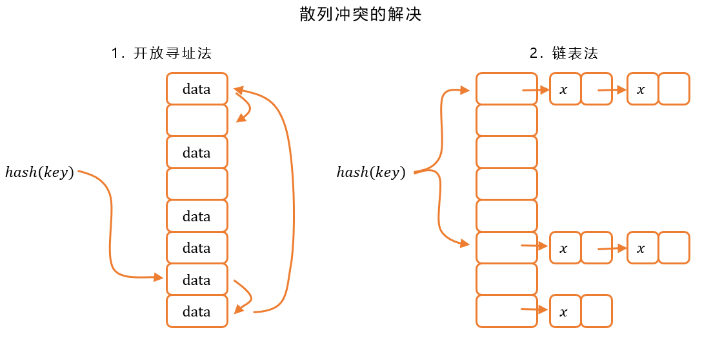

### 1. 散列函数

给一个函数输入一个键值 `key`，散列函数会返回计算得到的散列值。

散列函数有三个要求：

1. 计算得到的散列值为非负整数
2. 键值相同得到的散列值一定相同
3. 键值不同得到的散列值一定不同

前两个要求容易满足，但第三个要求却很难满足。

### 2. 散列冲突

对于上面的第三个要求，如果键值不同却得到了相同的散列值，就会产生散列冲突。可以使用开放寻址法和链表法来解决。

#### 2.1. 开放寻址法

利用线性探测：当出现散列冲突时（即计算得到的散列值已经有数据），继续往后寻找一个新的空闲位置插入。

缺点：散列冲突随着数据增长变得更容易出现。

装载因子：用来表示散列表中空位的多少，等于表中元素个数/散列表长度

#### 2.2. 链表法

每个位置都对应一条链，把散列值相同的数据放到同一条链表中。

