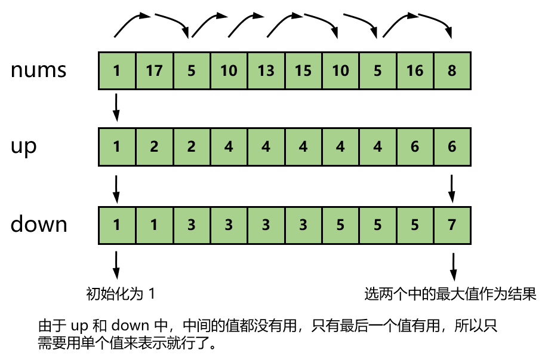
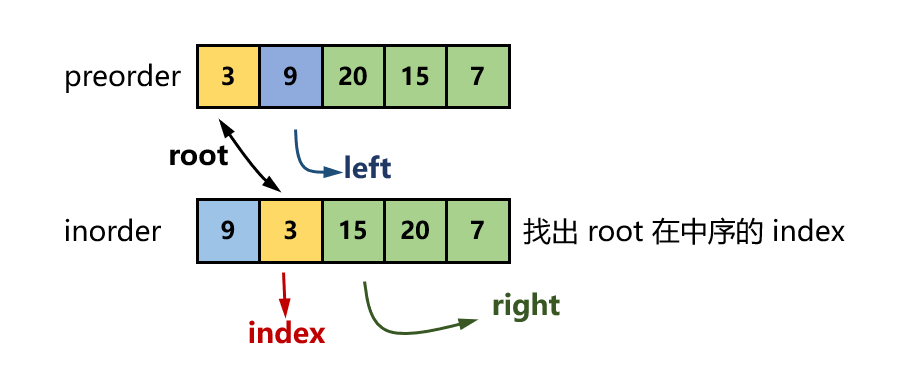

## 贪心

## 回溯

八皇后问题、0 - 1 背包、正则表达式

#### [面试题 08.12. 八皇后](https://leetcode-cn.com/problems/eight-queens-lcci/)

首先看看极客时间上用回溯法解的八皇后问题：

```python
n = 8
result = [0] * n
count = 0
def cal8queens(row):
    global count
    if row == n:
        printQueens(result)
        count += 1
        return
    for column in range(n):
        if isOk(row, column):
            result[row] = column
            cal8queens(row + 1)

def isOk(row,column):
    leftup, rightup = column - 1, column + 1
    for i in range(row-1, -1, -1):
        if result[i] == column: return False
        if leftup >= 0:
            if result[i] == leftup: return False
        if rightup < n:
            if result[i] == rightup: return False
        leftup -= 1
        rightup += 1
    return True

def printQueens(result):
    board = ""
    for row in range(n):
        for column in range(n):
            if result[row] == column: board += "Q "
            else: board += "* "
        board += '\n'
    print(board)
```


## 动态规划

可以用动态规划解决的问题，都有「一个模型三个特征」。模型是指问题可以抽象成分阶段决策最优解模型。动态规划通过当前阶段的状态，来推导下一个阶段的状态。可以使用动态规划的问题的特征[^1]。

**最优子结构**：问题的最优解包含子问题的最优解。也就是后面阶段的状态可以通过前面阶段的状态推导出来。

**无后效性**：是指如果在某个阶段上过程的状态已知，则从此阶段以后过程的发展变化仅与此阶段的状态有关，而与过程在此阶段以前的阶段所经历过的状态无关。利用动态规划方法求解多阶段决策过程问题，过程的状态必须具备无后效性。或者说，只关心前面阶段的状态值，并且后面阶段的决策不会对前面阶段造成影响。

**重复子问题**：不同的决策路线，可能会有重复的状态。

解决动态规划，有两种思路：

**（1）状态转移表**：在三维以下的情况下好用。

**（2）状态转移方程**：更像是递归。

**思考状态**：

- 先尝试「题目问什么，就把什么设置为状态」。
- 然后就是「状态转移方程」。如果不容易得到可以尝试修改定义。

**状态方程**：

- 推到技巧：对状态空间进行分类讨论
- 「空间换时间」，解题过程类似于在填表

**初始化**：

- 直接从语义出发
- 考虑状态方程所需要的边界条件
- 是否需要设置「哨兵」

**输出**：输出最后一个状态或者综合之前的状态

**优化空间**：

- 优化空间会使得代码难以理解，一开始写正确最重要
- 典型问题「0 - 1 背包」、「完全背包」

### 0-1 背包问题

### 买卖股票问题

#### [121. 买卖股票的最佳时机](https://leetcode-cn.com/problems/best-time-to-buy-and-sell-stock/)

参考 [liweiwei](https://leetcode-cn.com/problems/best-time-to-buy-and-sell-stock/solution/bao-li-mei-ju-dong-tai-gui-hua-chai-fen-si-xiang-b/)：动态方程：0 为不持有，1 为持有

`dp[i - 1][0] = max(dp[i - 1][0]), dp[i - 1][1] + prices[i])`

`dp[i][1] = max(dp[i - 1][1], -prices[i])`

```python
class Solution:
    def maxProfit(self, prices: List[int]) -> int:
        n = len(prices)
        if n < 2:
            return 0
        dp = [[0, 0]] * n
        dp[0][0], dp[0][1] = 0, -prices[0]
        for i in range(1, n):
            dp[i][0] = max(dp[i - 1][0], dp[i - 1][1] + prices[i])
            dp[i][1] = max(dp[i - 1][1], -prices[i])
        return dp[n - 1][0]
```

#### [122. 买卖股票的最佳时机 II](https://leetcode-cn.com/problems/best-time-to-buy-and-sell-stock-ii/)

**贪心算法**：`今天的价格 - 昨天的价格` 有 3 种情况：正、零、负。贪心算法只加正的。

```python
class Solution:
    def maxProfit(self, prices: List[int]) -> int:
        res = 0
        for i in range(len(prices) - 1):
            res += max(prices[i + 1] - prices[i], 0)
        return res
```

**动态规划**：[liweiwei](https://leetcode-cn.com/problems/best-time-to-buy-and-sell-stock-ii/solution/tan-xin-suan-fa-by-liweiwei1419-2/)

动态方程：
$$
dp[i][0] = \max(dp[i-1][0], dp[i-1][1] + prices[i])\\
dp[i][1] = \max(dp[i-1][1], dp[i-1][0] - prices[i])
$$
今天的情况有（1）维持昨天的不持有或者把昨天持有的股票在今天出了；（2）维持昨天的持有或者今天买股票。

```python
class Solution:
    def maxProfit(self, prices: List[int]) -> int:
        n = len(prices)
        if n < 2:
            return 0
        cash, hold = 0, -prices[0]
        preCash, preHold = cash, hold
        for i in range(1, n):
            cash = max(preCash, preHold + prices[i])
            hold = max(preHold, preCash - prices[i])
            preCash, preHold = cash, hold
        return cash
```

#### [123. 买卖股票的最佳时机 III](https://leetcode-cn.com/problems/best-time-to-buy-and-sell-stock-iii/)


### 简单题


### 中等题

#### [152. 乘积最大子数组](https://leetcode-cn.com/problems/maximum-product-subarray/solution/)

动态规划关心结果，而回溯算法关心过程。参考 [liweiwei](https://leetcode-cn.com/problems/maximum-product-subarray/solution/dong-tai-gui-hua-li-jie-wu-hou-xiao-xing-by-liweiw/) 的题解。

```python
class Solution:
    def maxProduct(self, nums: List[int]) -> int:
        curMin, curMax, ans = nums[0], nums[0], nums[0]
        for i in range(1, len(nums)):
            Min, Max = curMin, curMax
            curMin = min(Min * nums[i], nums[i], Max * nums[i])
            curMax = max(Min * nums[i], nums[i], Max * nums[i])
            ans = max(ans, curMax)
        return ans
```


#### [376. 摆动序列](https://leetcode-cn.com/problems/wiggle-subsequence/)

一开始可以使用两个数组 up 和 down 分别记录状态。如果现在的情况是上升，前一个情况为下降，那么久更新 up，反之更新 down。



```python
class Solution:
    def wiggleMaxLength(self, nums: List[int]) -> int:
        n = len(nums)
        if n < 2: return n
        up, down = 1, 1
        for i in range(1, n):
            if nums[i] > nums[i - 1]:
                up = down + 1
            elif nums[i] < nums[i - 1]:
                down = up + 1
        return max(up, down)
```


#### [1371. 每个元音包含偶数次的最长子字符串](https://leetcode-cn.com/problems/find-the-longest-substring-containing-vowels-in-even-counts/)

官方题解：

```python
class Solution:
    def findTheLongestSubstring(self, s: str) -> int:
        ans, status = 0, 0
        pos = [-1] * (1 << 5)
        pos[0] = 0
        for i in range(len(s)):
            if s[i] == 'a':
                status ^= 1 << 0
            elif s[i] == 'e':
                status ^= 1 << 1
            elif s[i] == 'i':
                status ^= 1 << 2
            elif s[i] == 'o':
                status ^= 1 << 3
            elif s[i] == 'u':
                status ^= 1 << 4
            if pos[status] >= 0:
                ans = max(ans, i + 1 - pos[status])
            else:
                pos[status] = i + 1
        return ans
```

重点的说一下 `ans = max(ans, i + 1 - pos[status])` 这一句为何可以算出最长字串长度。从判断来看，一开始除了 `s[0] == 0` 之外，其他的值都为 `-1`。第一次碰到一个状态，由于不满足 `pos[status] >= 0`，故更新该状态下的 `pos[status]` 为当前在字符串中的位置。到第二次又到达该状态的时候，把当前位置减去前一次出现该状态时候所处的位置。

可以这样操作的原因就是，**对于满足条件的子串而言，两个前缀和 $pre[i][k]$ 和  $pre[j][k]$ 的奇偶性一定是相同的，因为小学数学的知识告诉我们：奇数减奇数等于偶数，偶数减偶数等于偶数。** 

简化版 [[Java/C++/Python] One Pass](https://leetcode.com/problems/find-the-longest-substring-containing-vowels-in-even-counts/discuss/531840/JavaC%2B%2BPython-One-Pass)：

```python
class Solution:
    def findTheLongestSubstring(self, s: str) -> int:
        seen = {0: -1}
        res = cur = 0
        for i, c in enumerate(s):
            cur ^= 1 << ('aeiou'.find(c) + 1) >> 1
            seen.setdefault(cur, i)
            res = max(res, i - seen[cur])
        return res
```

执行用时短：

```python
from collections import defaultdict
class Solution:
	def findTheLongestSubstring(self, s):
		char = defaultdict(int)
		char.update(zip("aeiou", [1, 2, 4, 8, 16]))
		cur = 0
		situ = {i:[-1,-1] if not i else [] for i in range(32)}
		for i,j in enumerate(s):
			cur ^= char[j]
			if not situ[cur]:
				situ[cur] = [i,i]
			else:
				situ[cur][-1] = i
		return max(i[1] - i[0] for i in situ.values() if len(i) == 2)
```


#### [5. 最长回文子串](https://leetcode-cn.com/problems/longest-palindromic-substring/)

**动态规划**：状态：`dp[i][j]` 表示 `s[i...j]` 是否为回文串；方程：$dp[i][j]=(s[i]==s[j])\,and\,dp[i+1][j-1]$，注意边界条件。

```python
class Solution:
    def longestPalindrome(self, s: str) -> str:
        n = len(s)
        if n < 2:
            return s
        start, max_len = 0, 1
        dp = [[False for _ in range(n)] for _ in range(n)]
        for i in range(n):
            dp[i][i] = True
        for j in range(1, n):
            for i in range(j):
                # 简化，但损失易读性
                dp[i][j] = (s[i] == s[j]) and (j - i < 3 or dp[i + 1][j - 1])
                # if s[i] == s[j]:
                #     if j - i < 3:
                #         dp[i][j] = True
                #     else:
                #         dp[i][j] = dp[i + 1][j - 1]
                
                if dp[i][j] and j - i + 1 > max_len:
                    start, max_len = i, j - i + 1
        return s[start:start + max_len]
```

复杂度：$O(N^2)+O(N^2)$

**中心扩散法**：遍历每一个索引，以这个索引为中心，利用「回文串」中心对称的特点，往两边扩散，看最多能扩散多远。

```python
class Solution:
    def longestPalindrome(self, s: str) -> str:
        n = len(s)
        if n < 2:
            return s
        start, max_len = 0, 1
        def centerSpread(s, i, j):
            while i >= 0 and j < n and s[i] == s[j]:
                i -= 1
                j += 1
            return j - i - 1, i + 1
        for c in range(0, n):
            odd_len, odd_start = centerSpread(s, c - 1, c + 1)
            even_len, even_start = centerSpread(s, c, c + 1)
            if odd_len > max_len:
                start = odd_start
            elif even_len > max_len:
                start = even_start
            max_len = max(max_len, odd_len, even_len)
        return s[start:start + max_len]
```

复杂度：$O(N^2)+O(1)$ 比动态规划快

**Manacher 算法**：面试上并不要求，主要在了解思想

 **简单版**：$O(N^2)+O(N)$

```python
class Solution:
    def longestPalindrome(self, s: str) -> str:
        n = len(s)
        if n < 2:
            return s
        start, max_len = 0, 1
        new_s = "#"

        for i in range(n):
            new_s += s[i] + "#"
            
        def centerSpread(s, i):
            n = len(s)
            i, j = i - 1, i + 1 
            step = 0
            while i >= 0 and j < n and s[i] == s[j]:
                i -= 1
                j += 1
                step += 1
            return step

        for i in range(len(new_s)):
            cur_len = centerSpread(new_s, i)
            if cur_len > max_len:
                start, max_len = (i - cur_len) // 2, cur_len
        return s[start:start + max_len]
```


### 困难题

## 分治

分治与贪心、回溯和动态规划归为一类，

#### [105. 从前序与中序遍历序列构造二叉树](https://leetcode-cn.com/problems/construct-binary-tree-from-preorder-and-inorder-traversal/)

**一、递归**：[负雪明烛](https://leetcode-cn.com/problems/construct-binary-tree-from-preorder-and-inorder-traversal/solution/yi-ben-ti-wei-li-bang-zhu-li-jie-di-gui-by-fuxuemi/)

如何理解递归：

- 明确递归函数的输入和输出，将其看成是一个黑盒
- 不要试图用大脑理解递归的内部是如何运作的

先序遍历：根节点，左子树的先序遍历，右子树的先序遍历。
中序遍历：左子树的中序遍历，根节点，右子树的中序遍历。



```python
class Solution:
    def buildTree(self, preorder: List[int], inorder: List[int]) -> TreeNode:
        if not preorder or not inorder:
            return None
        root = TreeNode(preorder[0])
        index = inorder.index(preorder[0])
        root.left = self.buildTree(preorder[1:index + 1], inorder[:index])
        root.right = self.buildTree(preorder[index + 1:], inorder[index + 1:])
        return root
```

上面的代码，跑出来时间花费比较大，主要在于 `index = inorder.index(preorder[0])` 的优化。我们可以为此创建于一个哈希表，存储每一个结点值在中序中的 index。

```python
class Solution:
    def buildTree(self, preorder: List[int], inorder: List[int]) -> TreeNode:
        def myBuildTree(preorder_left: int, preorder_right: int, inorder_left: int, inorder_right: int):
            if preorder_left > preorder_right:
                return None
            
            preorder_root = preorder_left
            inorder_root = index[preorder[preorder_root]]
            root = TreeNode(preorder[preorder_root])
            size_left_subtree = inorder_root - inorder_left
            root.left = myBuildTree(preorder_left + 1, preorder_left + size_left_subtree, inorder_left, inorder_root - 1)
            root.right = myBuildTree(preorder_left + size_left_subtree + 1, preorder_right, inorder_root + 1, inorder_right)
            return root
        
        n = len(preorder)
        index = {element: i for i, element in enumerate(inorder)}
        return myBuildTree(0, n - 1, 0, n - 1)
```


---


[^1]: 极客时间课程，王争《数据结构与算法之美》第 41 课